# codex-review

Command-driven review loops for Claude Code and Codex.

`codex-review` turns "review this plan" and "review this implementation" into a repeatable workflow with:
- session-owned workflows
- sticky reviewed plans
- explicit findings and responses
- multi-round review without losing history



## Why this exists

Most AI review flows break down in the same places:
- the plan changes underneath the review
- implementation review loses the approved plan context
- multiple Claude threads in one repo step on each other
- findings get discussed in chat and then disappear

`codex-review` fixes those problems with a narrow command surface:
- `/codex-review:plan`
- `/codex-review:impl`
- `/codex-review:summary`
- `/codex-review:status`
- `/codex-review:doctor`

## What it does

1. `plan` snapshots the current Claude plan into a canonical workflow artifact.
2. Codex reviews that plan and writes a round artifact.
3. Claude writes findings responses in the same flow.
4. `impl` reviews implementation against the approved `plan.md`.
5. Every round stays on disk with a normalized decisions ledger.

## Quickstart

### Prerequisites

- [Go](https://go.dev/dl/) 1.22+
- [Claude Code](https://docs.anthropic.com/en/docs/claude-code)
- [OpenAI Codex CLI](https://github.com/openai/codex)

Install Codex CLI:

```bash
npm install -g @openai/codex
```

Install the plugin from a local checkout:

```bash
claude plugin add /path/to/codex-review
```

Or from GitHub:

```bash
claude plugin add github:boyand/codex-review
```

### Review a plan

```text
/codex-review:plan deeply review this plan
```

What happens:
- the current Claude thread resolves or creates its own workflow
- the current Claude plan is snapshotted into `artifacts/plan.md`
- Codex writes a plan review artifact
- Claude writes findings responses
- Claude shows the summary and asks what to do next

### Review the implementation

```text
/codex-review:impl review the implementation deeply
```

What happens:
- implementation is reviewed against the approved canonical `plan.md`
- if the workflow is still `plan/approval`, `impl` auto-advances to implementation
- Claude writes findings responses and shows the summary

### Inspect the current round

```text
/codex-review:summary
```

Use it to see:
- severity totals
- `FIX` vs `NO-CHANGE` vs `OPEN`
- what the current round actually decided

### Debug workflow/session resolution

```text
/codex-review:doctor
```

Use it when:
- the wrong workflow was picked
- the current Claude session was not resolved
- Codex or Go are missing

## The core idea

This plugin is intentionally small.

It does not try to be:
- a generic agent framework
- a dashboard product
- a hidden hook state machine

It is just a thin workflow around two high-value operations:
- review the plan
- review the implementation

That constraint is the product.

## How the workflow is stored

Workflows live under:

```text
.claude/codex-review/workflows/<workflow-id>/
```

Important files:
- `workflow.json`
- `decisions.tsv`
- `artifacts/plan.md`
- `artifacts/plan-review-rN.md`
- `artifacts/plan-findings-rN.md`
- `artifacts/implement-review-rN.md`
- `artifacts/implement-findings-rN.md`

Why this matters:
- the approved plan does not drift
- review history is preserved
- each Claude session can keep its own loop in the same repo

## Public commands

- `/codex-review:plan`
- `/codex-review:impl`
- `/codex-review:summary`
- `/codex-review:status`
- `/codex-review:doctor`

Internal transition commands still exist, but Claude runs them for you after your inline choice.

## Configuration

| Environment Variable | Default | Description |
|---------------------|---------|-------------|
| `CODEX_REVIEW_MODEL` | `gpt-5.3-codex` | Codex model for reviewer runs |
| `CODEX_REVIEW_FLAGS` | `--sandbox=read-only` | Flags for Codex reviewer runs |
| `CODEX_WORKER_FLAGS` | `--sandbox=workspace-write` | Flags for Codex worker runs |
| `CODEX_CALL_TIMEOUT_SEC` | `720` | Per-call Codex execution timeout in seconds |

Legacy aliases still accepted:
- `CODEX_REVIEW_LOOP_MODEL`
- `CODEX_REVIEW_LOOP_FLAGS`

## More docs

- [Quickstart](docs/quickstart.md)
- [FAQ](docs/faq.md)

## Open source notes

This repo is optimized for:
- local-first use
- GitHub-first distribution
- simple static docs

The launch surface should stay lightweight. A strong README, a sharp demo, and predictable commands matter more than a large docs framework.

## License

MIT
